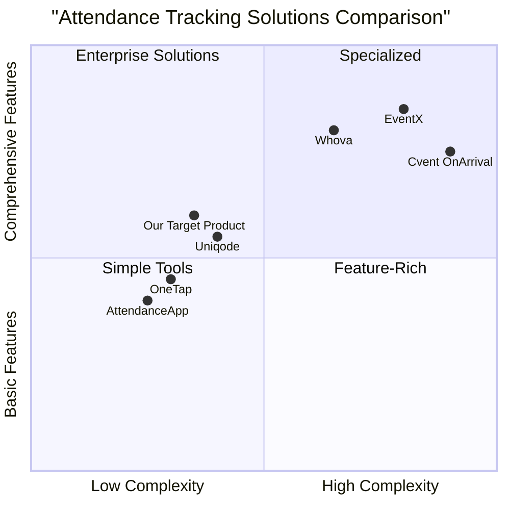

# Product Requirements Document: MICE Event Attendance Tracking System

## Overview

This document outlines the requirements for developing a QR code-based attendance tracking system for MICE (Meetings, Incentives, Conferences, and Exhibitions) events. The system will allow for efficient tracking of student attendance through QR code scanning, with time-in and time-out functionality and automatic email notifications.

### Original Requirements

1. QR code generation system for 30 students with their name and email
2. Printable format to attach to student IDs
3. Secretary (single user) scanning functionality
4. Time-in and time-out tracking
5. Email notifications confirming attendance
6. Supabase integration using provided credentials
7. Email functionality using provided Gmail account
8. Deployment to Vercel

## Product Goals

1. **Streamline Attendance Tracking**: Eliminate manual attendance recording by implementing an efficient QR code scanning system that accurately tracks student presence at events.

2. **Improve Communication Flow**: Enhance transparency through automated email notifications that confirm attendance and provide real-time updates to students.

3. **Simplify Administration**: Reduce administrative burden by centralizing attendance data and providing easy access to attendance records for event organizers.

## User Stories

### As an Event Secretary

1. As an event secretary, I want to scan student QR codes at entry and exit points so that I can accurately record attendance without manual paperwork.

2. As an event secretary, I want to view real-time attendance data so that I can quickly determine who is present and who is absent.

3. As an event secretary, I want the system to automatically send confirmation emails so that I don't have to manually notify students about their attendance status.

### As a Student

1. As a student, I want to receive a printable QR code ID that contains my information so that I can easily check in at events.

2. As a student, I want to receive email confirmations of my attendance so that I have proof of participation for my records.

### As an Administrator

1. As an administrator, I want access to attendance records so that I can generate reports on student participation.

## Competitive Analysis

### EventX
- **Pros**: Fast badge printing, real-time tracking, offline mode, ISO 27001 certified for data security
- **Cons**: Primarily designed for large conferences, may be overly complex for smaller educational events, higher pricing tier

### Cvent OnArrival
- **Pros**: Multiple check-in options, session tracking, deep integration with Cvent ecosystem
- **Cons**: Enterprise-focused pricing, steep learning curve, requires significant configuration

### Whova
- **Pros**: Multi-device compatibility, flexible check-in options, real-time data sync
- **Cons**: More focused on attendee engagement than simple attendance tracking, potentially overwhelming feature set

### OneTap
- **Pros**: Simple interface, works with existing IDs, privacy-focused approach
- **Cons**: Limited customization options, fewer advanced features for complex events

### Uniqode
- **Pros**: Customizable QR codes, bulk generation, Google Sheets integration
- **Cons**: Less robust event management features, limited real-time analytics

### AttendanceApp (Custom Solution)
- **Pros**: Tailor-made for educational events, simple user interface, cost-effective for small scale deployment
- **Cons**: Limited scalability beyond intended use case, fewer third-party integrations

### Our Target Product
- **Pros**: Purpose-built for educational events, streamlined for single-secretary operation, automatic email notifications, simple QR code generation and printing
- **Cons**: Limited to basic attendance tracking functionality, designed specifically for small-scale events (30 students)

## Competitive Quadrant Chart



## Technical Specifications

### Requirements Analysis

The MICE Event Attendance Tracking System will be developed as a web application using React for the frontend, with Supabase providing backend database services. The system will consist of three main components:

1. **Admin Panel**: For setting up events and managing student information
2. **QR Code Generator**: For creating and printing student QR codes
3. **Scanning Interface**: For the secretary to scan time-in and time-out

The application will utilize the provided Supabase credentials for data storage and retrieval, and the Gmail account for sending confirmation emails to students.

### Requirements Pool

#### P0 (Must-have)

1. Student Management System
   - Add, edit, and remove student information (name and email)
   - Generate unique QR codes for each student
   - Export QR codes in printable format for ID attachment

2. Scanning Interface
   - Camera access for QR code scanning
   - Toggle between time-in and time-out modes
   - Visual confirmation of successful scans

3. Attendance Tracking
   - Record time-in and time-out timestamps
   - Associate timestamps with student records
   - Store attendance data in Supabase database

4. Email Notifications
   - Send automated emails upon successful check-in/check-out
   - Include student name, event details, and timestamp in emails

5. Security
   - Secretary login with authentication
   - Secure storage of attendance records

#### P1 (Should-have)

1. Dashboard
   - Real-time attendance overview
   - List of present and absent students
   - Search functionality for finding specific students

2. Reporting
   - Generate attendance reports by date
   - Export attendance data to CSV/Excel
   - Summary statistics (attendance rate, average duration)

3. Event Management
   - Create and manage multiple events
   - Associate students with specific events

4. Mobile Responsiveness
   - Optimized interface for mobile scanning
   - Responsive design for all screen sizes

#### P2 (Nice-to-have)

1. Offline Mode
   - Cache student data for offline scanning
   - Sync data when connection is restored

2. Customizable Email Templates
   - Editable email content and formatting
   - Support for HTML email templates

3. Attendance Analytics
   - Visual charts of attendance patterns
   - Trend analysis over time

4. Bulk Operations
   - Import student data via CSV upload
   - Batch printing of QR codes

### UI Design Draft

#### 1. Login Screen
- Username and password input fields
- Login button
- Minimal design with logo

#### 2. Dashboard
- Summary cards showing attendance statistics
- Quick access buttons for main functions
- List of upcoming/ongoing events

#### 3. Student Management
- Table view of all students
- Add/Edit/Delete functions
- Bulk actions menu
- QR code generation button
- Print option

#### 4. QR Code Generator
- Preview of generated QR codes
- Options for size and format
- Print layout configuration
- Download as PDF option

#### 5. Scanning Interface
- Camera viewport
- Time-in/Time-out toggle
- Recent scans list
- Manual entry option
- Student info display after scan

#### 6. Reports
- Date range selector
- Event filter
- Table view of attendance records
- Export options
- Visual charts

### Data Models

#### Students Table
```
id: uuid (primary key)
name: string
email: string
qr_code: string (generated unique identifier)
created_at: timestamp
updated_at: timestamp
```

#### Attendance Records Table
```
id: uuid (primary key)
student_id: uuid (foreign key)
event_id: uuid (foreign key)
time_in: timestamp
time_out: timestamp
email_sent_in: boolean
email_sent_out: boolean
created_at: timestamp
updated_at: timestamp
```

#### Events Table
```
id: uuid (primary key)
name: string
description: string
date: date
start_time: time
end_time: time
location: string
created_at: timestamp
updated_at: timestamp
```

#### Users Table (Secretaries/Admins)
```
id: uuid (primary key)
email: string
password: string (hashed)
role: string
created_at: timestamp
updated_at: timestamp
```

## Open Questions

1. Will there be multiple events requiring separate attendance tracking, or is this system designed for a single recurring event?

2. Should the system support multiple secretaries/scanners, or will there always be only one user scanning?

3. Are there specific formatting requirements for the QR codes on student IDs (size, position, etc.)?

4. Is there a need for students to view their own attendance history through the system?

5. Should the system send notifications for absent students or only for those who attend?

## Implementation Timeline

### Phase 1 (Week 1-2)
- Set up Supabase database and tables
- Implement user authentication
- Develop student management functionality
- Create QR code generation component

### Phase 2 (Week 3-4)
- Build scanning interface
- Implement time-in/time-out logic
- Set up email notification system
- Create basic dashboard

### Phase 3 (Week 5-6)
- Develop reporting functionality
- Add mobile responsiveness
- Implement P1 features
- Testing and bug fixing

### Phase 4 (Week 7-8)
- Implement P2 features as time allows
- User acceptance testing
- Documentation
- Deployment to Vercel

## Success Metrics

1. **Efficiency**: Reduce check-in time to under 5 seconds per student
2. **Accuracy**: Achieve 99.9% accuracy in attendance recording
3. **Automation**: Successfully send email notifications for 100% of attendance events
4. **Adoption**: Secretary reports satisfaction with system usability
5. **Data Quality**: Complete attendance records for all tracked events

## Conclusion

The MICE Event Attendance Tracking System will provide an efficient solution for tracking student attendance at events using QR codes. By leveraging modern web technologies and the Supabase backend, the system will streamline the attendance process, reduce administrative overhead, and improve communication with students through automated notifications.